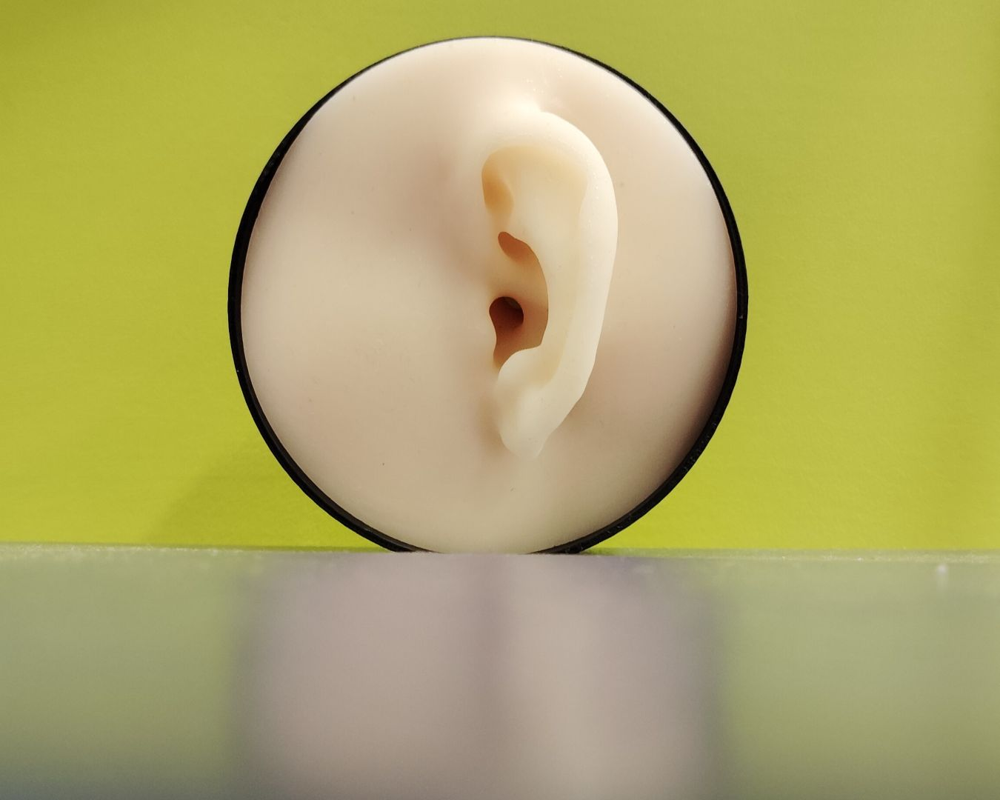

# Pinna Models Collection

# Overview
In this repository, I extracted 10 pinna (ear) models from the IHA Database of Human Geometries. These models have been processed and optimized for 3D printing and subsequent silicone molding. Whether you’re a researcher, engineer, or hobbyist, these models are available for educational, and research use.

  

# YouTube Video
For a quick visual overview of the entire process—from model extraction to the final silicone pinna—check out my video on YouTube!
- [1-Minute Silicone Pinna Timelapse](https://youtu.be/WkKg865pGbI).

# Source
The models were extracted from the IHA Database of Human Geometries. This database provides comprehensive anatomical data for research and development purposes. For more information about the Project, visit:
- [IHA Database of Human Geometries](https://zenodo.org/records/5528766)

# License
This project is licensed under the Creative Commons Attribution-ShareAlike 4.0 International (CC BY-SA 4.0) license.
